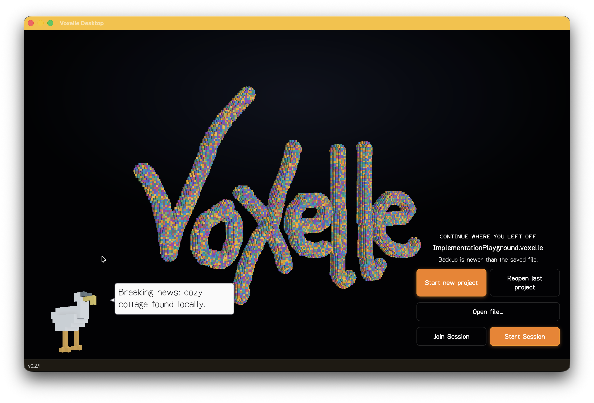

# Voxelle Desktop

A native voxel editor for macOS, Windows, and Linux. Open, create, sculpt, and paint voxel scenes in a fast GPU-accelerated viewport.

Based on the original [web version](https://zeldas.page/voxelle).

---

## Features

- **Draw** — place voxels with a brush using solid colors, FBM noise, gradients, or dithered patterns
- **Select** — pick, box-select, or paint-select voxels for batch operations
- **Sculpt** — push, pull, and smooth surfaces with pressure-sensitive strokes
- **Generators** — procedurally fill selections with noise-based or shape-based geometry
- **Squishy tool** — soft-body deformation for organic shaping
- **Mood settings** — ambient, lighting, and atmosphere controls including screen-space reflections
- **Fly camera** — FPS-style free camera with mouse look (hold right-click or use pointer lock)
- **Walk mode** — ground-constrained navigation
- **Gamepad support** — radial menu and camera control via controller
- **Collaboration** — join multiplayer sessions to edit scenes together
- **Auto-update** — the app checks for and installs updates automatically

## Getting the app

Download the latest release from the [releases page](https://github.com/Velfi/Voxelle-Desktop/releases).

The app will notify you when updates are available and can install them automatically.

## Requirements

| Platform | Minimum version |
|----------|----------------|
| macOS    | 11.0 (Big Sur) |
| Windows  | Windows 10     |
| Linux    | Ubuntu 20.04+  |

## Examples

See examples and works-in-progress on [Bluesky](https://bsky.app/profile/zeldaspage.bsky.social).

## File format

Voxelle Desktop uses the [`.voxelle` file format (v4)](docs/VOXELLE_FORMAT_V4.md). Files store voxel geometry, materials, and metadata in a compact binary container.

---

For development setup and contribution guidance, see [CONTRIBUTORS.md](CONTRIBUTORS.md).
