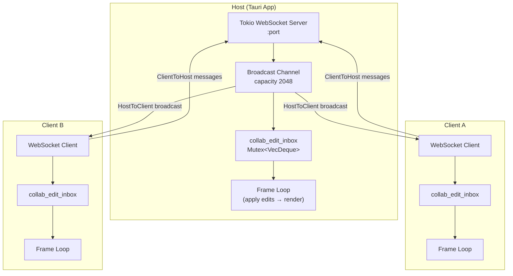
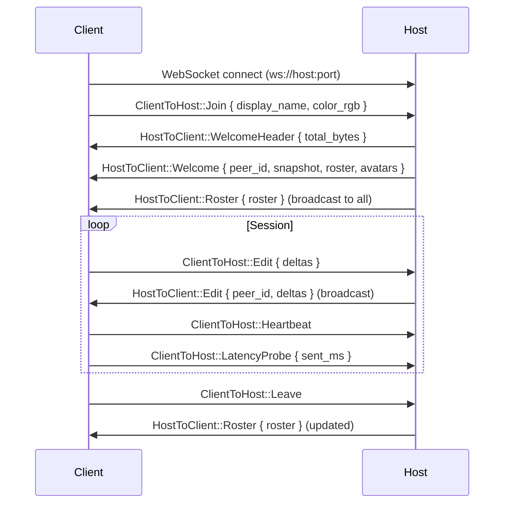
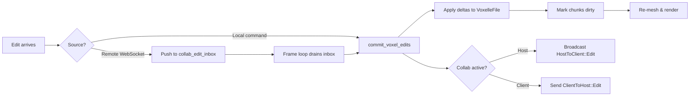

# Collaboration Server

Voxelle Desktop supports real-time multiplayer editing over WebSockets. One instance acts as the **host** (runs the server); others connect as **clients**.

## Architecture

## Connection Flow

## Host Mode

Started via the `collab_host_start` command. The host:

1. Binds a **tokio TCP listener** on the chosen port.
2. Optionally enables **UPnP** port forwarding for LAN discovery.
3. Accepts WebSocket upgrades and spawns a task per connection.
4. Maintains a **broadcast channel** (capacity 2048) — every message sent by the host is delivered to all connected clients.
5. **Slow client eviction**: if a client falls behind by more than 10 seconds of broadcast lag, the connection is dropped.

## Client Mode

Started via the `collab_join` command. The client:

1. Spawns a tokio task that connects via `tokio_tungstenite`.
2. Sends a `Join` message with display name and avatar color.
3. Receives a `Welcome` message containing the full voxel snapshot and peer roster.
4. Enters a read/write loop: incoming edits are pushed to `collab_edit_inbox`; local edits are sent as `ClientToHost::Edit`.

## Message Types

### Client → Host

| Message        | Fields                        | Purpose                 |
| -------------- | ----------------------------- | ----------------------- |
| `Join`         | `display_name`, `color_rgb`   | Announce presence       |
| `Edit`         | `deltas: Vec<VoxelEditDelta>` | Voxel modifications     |
| `Undo`         | —                             | Undo last local edit    |
| `Redo`         | —                             | Redo last undone edit   |
| `Chat`         | `text`                        | Chat message            |
| `Ping`         | `x, y, z`                     | World-space ping marker |
| `Heartbeat`    | —                             | Keep-alive              |
| `LatencyProbe` | `sent_ms`                     | RTT measurement         |
| `Leave`        | —                             | Graceful disconnect     |
| `AvatarChoice` | `avatar_name`                 | Select a preset avatar  |
| `AvatarData`   | `name, bytes`                 | Upload custom avatar    |

### Host → Client

| Message          | Fields                                                         | Purpose                                     |
| ---------------- | -------------------------------------------------------------- | ------------------------------------------- |
| `Welcome`        | `peer_id`, `snapshot`, `roster`, `avatar_names`, `avatar_data` | Initial state sync                          |
| `WelcomeHeader`  | `total_bytes`                                                  | Progress hint for large snapshots           |
| `Roster`         | `roster`                                                       | Updated peer list (broadcast on join/leave) |
| `Edit`           | `peer_id`, `deltas`                                            | Broadcast voxel edits                       |
| `Undo`           | `peer_id`                                                      | Broadcast undo                              |
| `Redo`           | `peer_id`                                                      | Broadcast redo                              |
| `Chat`           | `peer_id`, `display_name`, `text`, `ts_ms`                     | Broadcast chat message                      |
| `Ping`           | `peer_id`, `x, y, z`, `display_name`, `emoji`                  | Broadcast world ping                        |
| `CameraPresence` | peer cameras                                                   | Broadcast camera positions for avatars      |

All messages are serialized as JSON via `serde_json`.

## Edit Processing

Edits — whether local or remote — follow the same path to the GPU:

This ensures all peers converge on the same voxel state. The host is authoritative — it rebroadcasts client edits to all other clients.

## Async Primitives

| Primitive                             | Usage                                            |
| ------------------------------------- | ------------------------------------------------ |
| `tokio::sync::broadcast`              | Host → all clients (fan-out)                     |
| `tokio::sync::mpsc`                   | Per-client send queue                            |
| `tokio_util::sync::CancellationToken` | Graceful shutdown of host/client tasks           |
| `Mutex<VecDeque<CollabInboxItem>>`    | Thread-safe edit inbox drained by the frame loop |

## Key Files

| File                          | Responsibility                                       |
| ----------------------------- | ---------------------------------------------------- |
| `src-tauri/src/collab.rs`     | WebSocket server, client, message types, peer roster |
| `src-tauri/src/state.rs`      | `CollabRuntime`, `collab_edit_inbox`                 |
| `src-tauri/src/frame_loop.rs` | Inbox draining, `process_inbox_items_batched()`      |
| `src-tauri/src/lib.rs`        | `collab_host_start`, `collab_join` command wrappers  |
| `src/App.tsx`                 | Frontend collab UI, event listeners                  |
