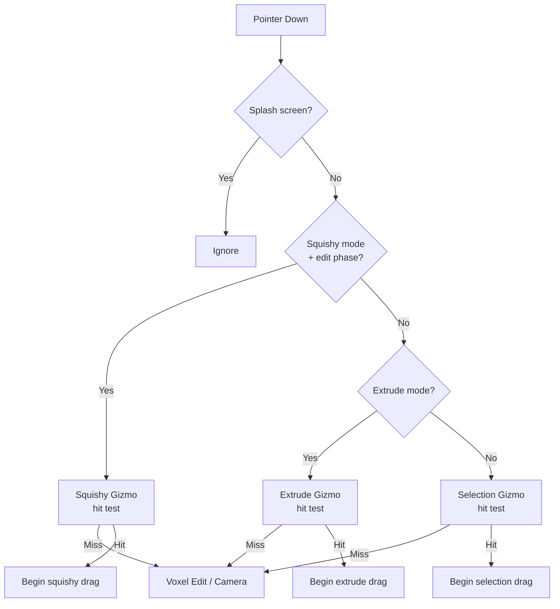

# Gizmos

Voxelle Desktop has four gizmos for manipulating objects, selections, and the camera. Each gizmo is a thin React component that forwards pointer events to Rust via Tauri IPC, where the actual math happens.

## Overview

| Gizmo | Purpose | Handles | Activation |
|-------|---------|---------|------------|
| [Selection](#selection-gizmo) | Translate + rotate selected voxels | 6 arrows + 3 rotation rings | Any mode except Extrude |
| [Extrude](#extrude-gizmo) | Extend/retract selection along an axis | 6 arrows | Extrude mode only |
| [Squishy](#squishy-gizmo) | Move/scale metaballs | 3 arrows + 1 scale handle per ball | Squishy edit mode |
| [Orbit](#orbit-gizmo) | Control camera angles | 6 axis indicators + edge band | Always visible in HUD |

## Gesture Priority

When the user presses down on the viewport, gizmos are checked in this order. The first hit wins.

---

## Selection Gizmo

**Files:** `src/SelectionGizmo.tsx`, `src-tauri/src/commands/selection.rs`

The main transform gizmo. Appears when voxels are selected (outside of Extrude mode).

### Handles

- **6 directional arrows** — translate selection ±X, ±Y, ±Z (one voxel step per threshold)
- **3 rotation rings** — rotate selection around X, Y, or Z axis (90° snapped steps)
- Colors: X = red `[1.0, 0.36, 0.4]`, Y = green `[0.34, 0.84, 0.43]`, Z = blue `[0.36, 0.63, 1.0]`
- Hovered axis brightens for visual feedback

### Tauri Commands

| Command | Purpose |
|---------|---------|
| `gizmo_pointer_down` | Hit-test arrows and rings; returns `true` if a handle was hit |
| `gizmo_pointer_move` | Accumulate screen-space delta into voxel translation/rotation steps |
| `gizmo_pointer_up` | Commit the transform (apply pending dx/dy/dz or rotation) |
| `gizmo_hit_test` | Hover feedback — stores which axis (0=X, 1=Y, 2=Z, 255=none) |

### Drag Mechanics

**Translation:**
1. On pointer-down, the hit arrow's world axis is projected to screen space → `axis_sx, axis_sy`.
2. Each pointer-move accumulates screen pixels along that projected direction.
3. When `accum` exceeds `step_threshold` (DPR-adjusted CSS pixels), a voxel step is queued.
4. On pointer-up, pending steps (`pending_dx/dy/dz`) are committed as a voxel edit.

**Rotation:**
1. On pointer-down, the hit ring's tangent at the click point is projected to screen space.
2. Pointer-move accumulates pixels along the tangent direction.
3. Each threshold crossing triggers a 90° rotation step.
4. On pointer-up, the rotation is committed.

### GPU Rendering

Rendered by `sync_gizmo_gpu()` in `frame_loop.rs` as colored wireframe arrows and rings. The `gizmo_on_top` preference controls whether the gizmo renders above all geometry (default: true) or respects depth testing.

---

## Extrude Gizmo

**Files:** `src/ExtrudeGizmo.tsx`, `src-tauri/src/commands/selection.rs`

Simpler variant of the Selection Gizmo — arrows only, no rotation rings. Active exclusively in Extrude mode.

### Handles

- **6 directional arrows** — extrude selection depth ±X, ±Y, ±Z
- Same color scheme as Selection Gizmo
- No rotation rings

### Tauri Commands

| Command | Purpose |
|---------|---------|
| `extrude_gizmo_pointer_down` | Hit-test arrows; returns `true` if hit |
| `extrude_gizmo_pointer_move` | Accumulate delta, call `extrude_gizmo_preview_inner()` with current color + material |
| `extrude_gizmo_pointer_up` | Update base depth for next drag |
| `extrude_gizmo_hit_test` | Hover feedback (axis 0–2, 255=none) |

### Drag Mechanics

1. Works like Selection Gizmo translation, but tracks signed `depth` instead of pending voxel offsets.
2. Each threshold crossing increments or decrements the extrusion depth.
3. A live preview is rendered during the drag showing the extruded voxels with the active color and material.
4. On pointer-up, the extrusion is committed.

### Preview Mode

When active, the renderer enters `PreviewMode::SelectExtrude`, which renders arrows without rings in `sync_gizmo_gpu()`.

---

## Squishy Gizmo

**Files:** `src-tauri/src/generators/squishy_gizmo.rs`, `src-tauri/src/commands/generators.rs`

Manipulates individual metaballs in the Squishy procedural generator.

### Handles

Each selected metaball gets 4 handles:

| Handle | Color | Direction | Action |
|--------|-------|-----------|--------|
| `MoveX` | Red | X axis | Translate along X |
| `MoveY` | Green | Y axis | Translate along Y |
| `MoveZ` | Blue | Z axis | Translate along Z |
| `Scale` | White | Diagonal (1,1,1) | Uniform radius scale |

### Tauri Commands

| Command | Purpose |
|---------|---------|
| `squishy_gizmo_pointer_down` | Hit-test + initialize drag plane |
| `squishy_gizmo_pointer_move` | Ray-plane intersection → update metaball position/radius |
| `squishy_gizmo_pointer_up` | Clear drag state |

### Drag Mechanics

Unlike the grid-snapped Selection/Extrude gizmos, the Squishy Gizmo uses **continuous plane-drag**:

1. On pointer-down, a plane is constructed perpendicular to the camera view direction, passing through the metaball center.
2. Each pointer-move casts a ray from the cursor and intersects it with this plane.
3. The delta from the initial intersection point is projected onto the handle's axis (or applied uniformly for Scale).
4. Radius is clamped to `[0.5, 64.0]` voxel units.

### Hit Testing

`pick_squishy_gizmo_handle()` projects each handle's 3D wireframe segments to screen space and finds the closest handle within a 24-pixel pick radius (20 samples per handle).

### GPU Rendering

Rendered as colored wireframe cubes along each axis plus a diagonal scale indicator. Handle size scales with view distance: `dist × 0.028`, clamped to `[0.22, 0.58]`. Arms extend from the ball surface with offset `(radius + 0.9).max(1.2)`.

---

## Orbit Gizmo

**Files:** `src/ViewportCameraHud.tsx`

An always-visible camera control widget in the top-left corner of the viewport (120×120px Canvas 2D — not GPU-rendered).

### Handles

- **6 axis indicators** — labeled X+, Y+, Z+, X−, Y−, Z− circles projected from 3D
- **Edge band** — outer ring for theta-only (azimuth) rotation
- **Center area** — full orbit drag (theta + phi)

### Interactions

| Action | Behavior |
|--------|----------|
| Click axis label | Snap camera to that cardinal view (`camera_snap_orbit_axis`) |
| Drag center | Full orbit rotation (`camera_orbit_gizmo_drag` with `thetaOnly: false`) |
| Drag edge band | Azimuth-only rotation (`camera_orbit_gizmo_drag` with `thetaOnly: true`) |

### Tauri Commands

| Command | Purpose |
|---------|---------|
| `get_orbit_gizmo_projection` | Returns 6 projected screen positions (called ~60 fps) |
| `camera_snap_orbit_axis` | Snap to axis-aligned view (axis 0–5) |
| `camera_orbit_gizmo_drag` | Apply rotation delta |
| `camera_zoom_step` | Zoom in/out |
| `camera_fit_to_scene` | Frame all content |
| `camera_reset_view` | Reset to default viewpoint |

### Rendering

Drawn entirely in a Canvas 2D overlay — not part of the GPU pipeline. The 3D axis positions are fetched from Rust each frame and projected to the 2D canvas.

---

## Shared Configuration

### `gizmoOnTop` Preference

| Setting | Behavior |
|---------|----------|
| `true` (default) | Gizmo renders on top of all geometry, ignoring depth |
| `false` | Gizmo respects depth testing and can be occluded by voxels |

Set via the `set_gizmo_on_top` Tauri command. Stored in `WgpuViewer.gizmo_on_top`.
