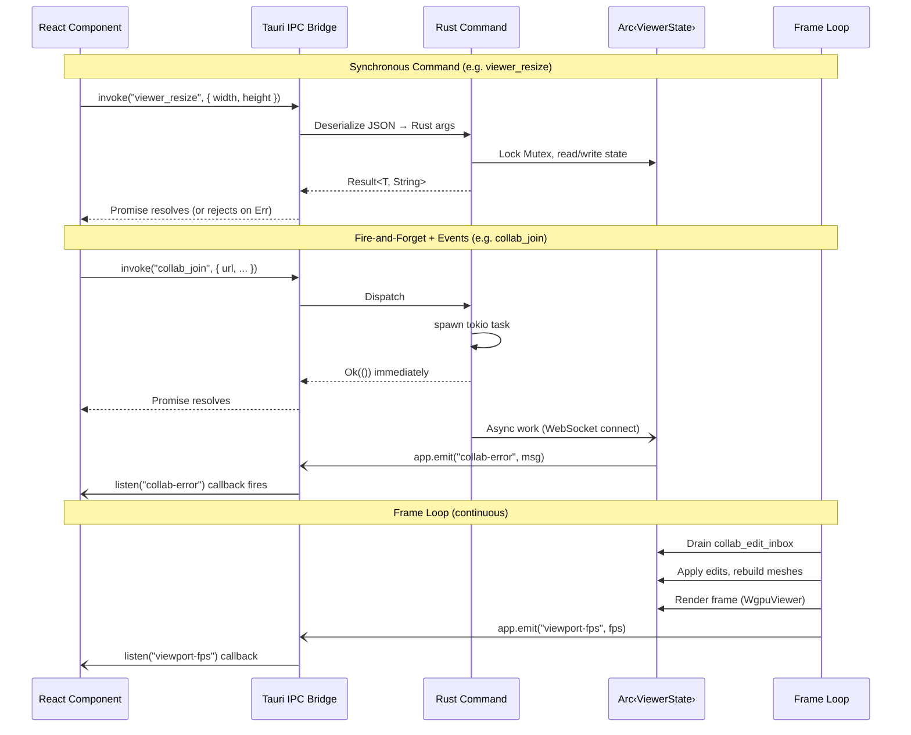
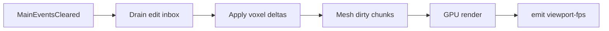
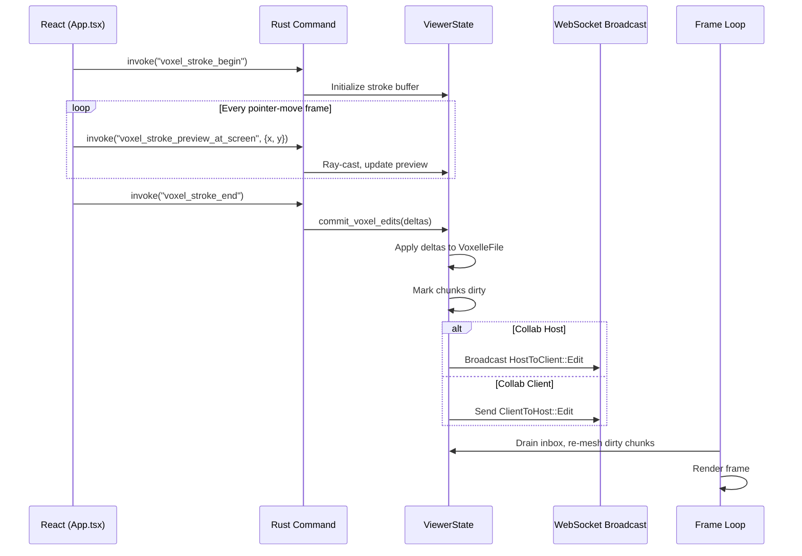

# Request / Response Lifecycle

Voxelle Desktop is a [Tauri v2](https://v2.tauri.app/) app. The frontend is React/TypeScript; the backend is Rust. All communication between the two layers flows through Tauri's IPC bridge.

## Overview Diagram



## Three Communication Patterns

### 1. Synchronous Command → Response

The most common pattern. The frontend calls `invoke()`, which returns a `Promise` that resolves with the Rust function's return value (serialized as JSON).

```typescript
// Frontend (TypeScript)
const size = await invoke<ViewportPixelSize>("get_viewport_pixel_size");
```

```rust
// Backend (Rust)
#[tauri::command]
fn get_viewport_pixel_size(
    state: State<'_, Arc<ViewerState>>,
) -> Result<ViewportPixelSize, String> {
    let v = state.viewer.lock();
    // ...return data...
}
```

The command has access to shared state via `State<'_, Arc<ViewerState>>`. Fields are protected by `Mutex` and locked on demand.

### 2. Fire-and-Forget + Events

Long-running operations return `Ok(())` immediately and spawn a tokio task. Results arrive later as Tauri events.

```rust
#[tauri::command]
fn collab_join(
    state: State<'_, Arc<ViewerState>>,
    app: AppHandle,
    url: String,
    // ...
) -> Result<(), String> {
    tauri::async_runtime::spawn(async move {
        match collab::client_connect_blocking(&url, app.clone(), /*...*/).await {
            Ok(_) => {}
            Err(e) => { app.emit("collab-error", e.to_string()).ok(); }
        }
    });
    Ok(())
}
```

```typescript
// Frontend listens for async results
listen<string>("collab-error", (e) => {
  showError(e.payload);
});
```

### 3. Frame-Loop Events

The Tauri `MainEventsCleared` run-event fires once per frame. Voxelle uses this as its render heartbeat:

1. **Drain inbox** — `collab_edit_inbox` is a `Mutex<VecDeque<CollabInboxItem>>`. Remote edits from WebSocket handlers are pushed here and applied on the main thread.
2. **Rebuild meshes** — Dirty chunks are re-meshed (CPU greedy mesh or GPU compute).
3. **Render** — `WgpuViewer` executes the full shader pipeline.
4. **Emit telemetry** — FPS, viewport size, and progress events are emitted to the frontend.



## Shared State

All commands share a single `Arc<ViewerState>` managed by Tauri. Key fields:

| Field               | Type                               | Purpose                           |
| ------------------- | ---------------------------------- | --------------------------------- |
| `viewer`            | `Mutex<Option<WgpuViewer>>`        | GPU renderer                      |
| `camera`            | `Mutex<OrbitCamera>`               | Camera position and projection    |
| `current_file`      | `Mutex<Option<VoxelleFile>>`       | Loaded `.voxelle` file            |
| `stroke_buffer`     | `Mutex<Vec<...>>`                  | Active brush stroke vertices      |
| `selection_cells`   | `Mutex<AHashSet<...>>`             | Currently selected voxels         |
| `collab`            | `Arc<Mutex<CollabRuntime>>`        | Collaboration state & peer roster |
| `collab_edit_inbox` | `Mutex<VecDeque<CollabInboxItem>>` | Queued remote edits               |
| `chunk_mesh_inbox`  | `Mutex<VecDeque<...>>`             | Pending GPU mesh uploads          |

## Command Registration

Commands are registered in `lib.rs` via the `tauri::generate_handler!` macro (~180 commands). Each command must also have a permission entry in `src-tauri/permissions/voxelle.toml`.

```rust
tauri::Builder::default()
    .manage(viewer_state.clone())
    .invoke_handler(tauri::generate_handler![
        viewer_resize,
        voxel_stroke_begin,
        voxel_stroke_end,
        collab_host_start,
        collab_join,
        // ...~180 more...
    ])
```

## Voxel Edit Flow (End-to-End Example)



## Frontend Event Listeners

The frontend registers listeners at startup for backend-initiated events:

| Event                   | Payload             | Source                  |
| ----------------------- | ------------------- | ----------------------- |
| `viewport-fps`          | `number`            | Frame loop              |
| `viewport-pixel-size`   | `{ w, h }`          | Resize handler          |
| `voxelle-load-start`    | `string` (filename) | File open command       |
| `voxelle-work-progress` | `string` (message)  | Long operations         |
| `collab-chat`           | `string`            | Collaboration chat      |
| `collab-ping`           | `string`            | Peer ping notifications |
| `collab-error`          | `string`            | Connection failures     |
