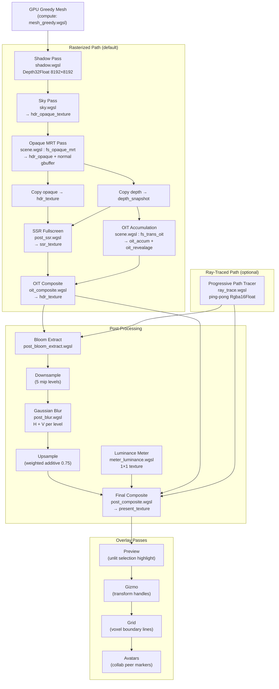

# Shader Pipeline

Voxelle Desktop renders voxels using a multi-pass HDR pipeline built on `wgpu`. There are two rendering paths: a **rasterized** path (default) and an optional **ray-traced** path.

## Pipeline Overview



## Render Passes

### 1. GPU Greedy Mesh (Compute)

**Shader:** `render/gpu/mesh_greedy.wgsl`

Converts voxel brick data into triangle meshes on the GPU.

| Binding | Type | Description |
|---------|------|-------------|
| `brick_cells` | Storage (read) | Raw voxel data (`u32` per cell) |
| `slice_headers` | Storage (read) | Per-slice greedy mesh metadata |
| `slice_bits` | Storage (read) | Bitmap per 64×64 slice |
| `vtx_out` | Storage (write) | Output vertices (14×f32 stride) |
| `idx_out` | Storage (write) | Triangle indices |
| `alloc` | Storage (atomic) | Vertex/index counters |

Each workgroup processes a 64×64 slice independently with greedy face merging and per-vertex AO.

### 2. Shadow Pass

**Shader:** `shadow.wgsl` (vertex-only, depth attachment)

| Input | Output |
|-------|--------|
| Opaque mesh (position, normal, mat_kind) | `shadow_texture` (Depth32Float, 8192×8192) |
| `light_view_proj` matrix | |

Renders from the directional light's point of view. `glass_shadow_push()` handles transmissive materials by pushing depth along the slab thickness.

### 3. Sky Pass

**Shader:** `sky.wgsl`

| Input | Output |
|-------|--------|
| Camera inverse view/proj | `hdr_opaque_texture` (background fill) |
| Light direction, sun/ambient colors | |

Analytic atmosphere with Rayleigh scattering, chromatic extinction, day/night blending, and procedural stars.

### 4. Opaque MRT Pass

**Shader:** `scene.wgsl` → `fs_opaque_mrt`

| Input | Output |
|-------|--------|
| Opaque vertex (position, normal, color, mat_kind, vertex_ao, emission_tint) | `hdr_opaque_texture` (RGB color + glow mask in alpha) |
| Shadow map, GlobalState | `normal_texture` (world normal + metalness) |
| | `depth_texture` (Depth32Float) |

Handles all 9 material types with physically-based shading:

| Material | Shading Model |
|----------|--------------|
| **Plastic** | Blinn-Phong specular |
| **Metal** | Tinted specular, Fresnel (F0 = 0.96) |
| **Rubber** | Blinn-Phong (low specular) |
| **Glass** | Transmissive (handled in OIT pass) |
| **Water** | Transmissive (handled in OIT pass) |
| **Glow** | Self-illuminated (4× emission), shape hints |
| **Velvet** | Anisotropic sheen, rim lighting, wrap diffuse |
| **Wax** | Subsurface scattering, spectral absorption, Fresnel sheen |
| **Holographic** | Thin-film interference + diffraction grating |

### 5. Screen-Space Reflections

**Shader:** `post_ssr.wgsl`

| Input | Output |
|-------|--------|
| `hdr_opaque_texture` (scene to reflect) | `ssr_texture` (RGB reflection + confidence in alpha) |
| `depth_snapshot_texture` (opaque depth) | |

DDA ray march in screen space. Confidence fades at screen edges and with distance. Sky fallback for escaping rays.

### 6. OIT (Order-Independent Transparency)

**Accumulation shader:** `scene.wgsl` → `fs_trans_oit`

| Input | Output |
|-------|--------|
| Transparent mesh (glass, water) | `oit_accum_texture` (weighted color + alpha sum) |
| `depth_snapshot_texture` | `oit_revealage_texture` (product of 1−alpha) |

Uses weighted blended OIT. Transmission physics include IOR-based refraction (glass 1.5, water 1.333), thickness via voxel marching, and Fresnel-weighted split.

**Composite shader:** `oit_composite.wgsl`

Blends transparent and opaque layers:
```
avg_color = accum.rgb / accum.a
result = avg_color × (1 − revealage) + opaque × revealage
```

Also composites SSR reflections.

### 7. Bloom

| Stage | Shader | Description |
|-------|--------|-------------|
| **Extract** | `post_bloom_extract.wgsl` | Soft-knee threshold; glow voxels bloom from luminance |
| **Downsample** | `post_blit.wgsl` | Hardware bilinear, 5 mip levels (÷2 each) |
| **Blur** | `post_blur.wgsl` | Separable Gaussian, horizontal then vertical per level |
| **Upsample** | `post_blit.wgsl` (weighted add) | Coarsest → finest, ×0.75 falloff per level |

Parameters: strength 0.88, radius 0.42, threshold 0.15.

### 8. Luminance Metering

**Shader:** `meter_luminance.wgsl`

Computes average scene brightness into a 1×1 texture for auto-exposure.

### 9. Final Composite

**Shader:** `post_composite.wgsl`

| Input | Output |
|-------|--------|
| `hdr_texture` (full scene) | `present_texture` (SDR or HDR) |
| `bloom_a` (bloom result) | |
| 224-byte options uniform | |

Post-effects applied:

| Effect | Details |
|--------|---------|
| **Tone mapping** | Linear, Reinhard, ACES, or Filmic |
| **Exposure** | −5 to +5 EV |
| **Vignette** | Adjustable radius and strength |
| **Film grain** | Monochrome or colorful, animated |
| **Atmosphere** | Slab or aerial, plane or volumetric |
| **Distance tint** | Near/mid/far color grading |
| **Sun shafts** | God rays with decay |

### 10. Ray Trace Path (Optional)

**Shader:** `ray_trace.wgsl`

Progressive path tracer as an alternative to the rasterized path.

| Input | Output |
|-------|--------|
| GlobalState (brick, light, camera) | `rt_accum_textures` (ping-pong Rgba16Float) |
| Previous accumulation buffer | |
| `RtUniform` (frame_seed, sample_n, fast_preview) | |

- Per-pixel jittered primary rays
- Voxel DDA traversal
- Up to 2 light bounces (shade_primary → shade_metal/transmissive → shade_secondary)
- Fast preview mode: 1 shadow ray, no bounces (used during camera motion)
- Running mean accumulation: `mix(prev, sample, 1 / (n + 1))`

## Texture Inventory

| Texture | Format | Size | Purpose |
|---------|--------|------|---------|
| `shadow_texture` | Depth32Float | 8192×8192 | Directional shadow map |
| `hdr_opaque_texture` | Rgba16Float | viewport | Opaque pass result |
| `hdr_texture` | Rgba16Float | viewport | Composited scene (opaque + transparent) |
| `normal_texture` | Rgba16Float | viewport | G-buffer normals + metalness |
| `depth_texture` | Depth32Float | viewport | Scene depth |
| `depth_snapshot_texture` | Depth32Float | viewport | Read-only opaque depth copy |
| `oit_accum_texture` | Rgba16Float | viewport | OIT weighted accumulation |
| `oit_revealage_texture` | R16Float | viewport | OIT transparency weight |
| `ssr_texture` | Rgba16Float | viewport | Screen-space reflections |
| `bloom_a` / `bloom_b` | Rgba16Float | viewport | Bloom working textures |
| `bloom_pyramid_a[5]` | Rgba16Float | ÷2 … ÷32 | Bloom mip chain |
| `bloom_pyramid_b[5]` | Rgba16Float | ÷2 … ÷32 | Bloom blur temp |
| `present_texture` | Rgba8Unorm / Rgba16Float | viewport | Final output (SDR or HDR) |
| `rt_accum_textures[2]` | Rgba16Float | viewport | Ray tracer ping-pong |
| `rt_preview_tex` | Rgba16Float | viewport ÷ 2 | Half-res ray tracer (upscaled) |
| `meter_texture` | Rgba8Unorm | 1×1 | Average luminance |

## Voxel Data Format

Each voxel is a single `u32`:

```
bit 31       : occupied (1 = solid)
bits 30–28   : reserved
bits 27–24   : material (0–8)
bits 23–16   : blue
bits 15–8    : green
bits 7–0     : red
```

Materials: 0=Plastic, 1=Metal, 2=Rubber, 3=Glass, 4=Water, 5=Glow, 6=Velvet, 7=Wax, 8=Holographic.

## Key Files

| File | Responsibility |
|------|---------------|
| `src-tauri/src/render/mod.rs` | Pipeline creation, render pass orchestration |
| `src-tauri/src/render/scene.wgsl` | Opaque MRT + transparent OIT fragment shaders |
| `src-tauri/src/render/shadow.wgsl` | Shadow depth pass |
| `src-tauri/src/render/ray_trace.wgsl` | Progressive path tracer |
| `src-tauri/src/render/gpu/mesh_greedy.wgsl` | Compute greedy mesher |
| `src-tauri/src/shaders.wgsl` | Shared structs and utility functions |
| `src-tauri/src/render_constants.rs` | Material parameters, bloom/shadow constants |
| `src-tauri/src/gpu_brick.rs` | Voxel brick GPU data layout |
| `src-tauri/src/greedy_mesh.rs` | CPU-side greedy mesh fallback |
| `src-tauri/src/smooth_mesh.rs` | Smooth mesh generation |
